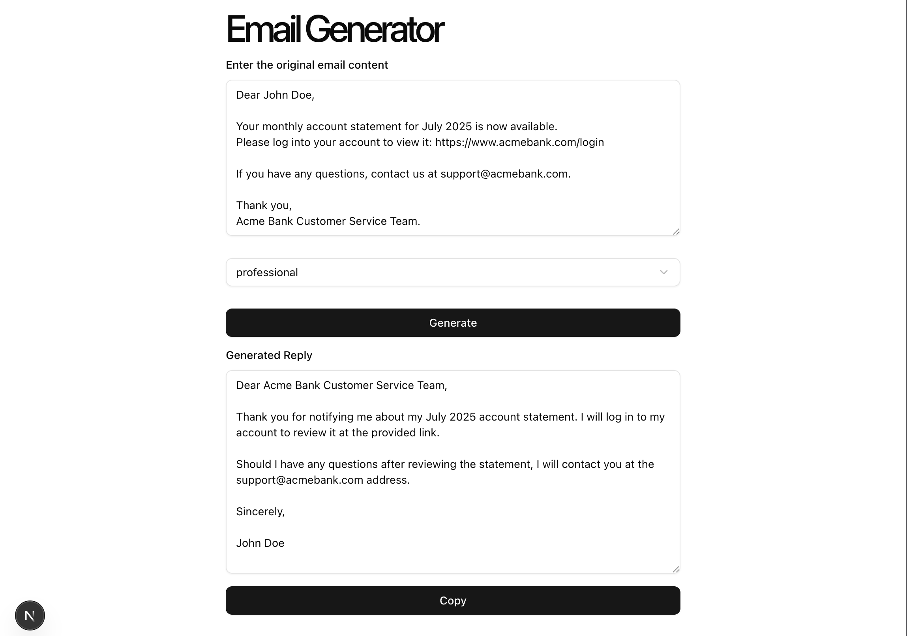

# 📧 Email Generator Assistant
An AI-powered assistant that helps you create professional email replies for the actual email content you share.
It’s available as both a web application and a browser extension, so you can generate responses wherever you work.



## ✨ Features
📝 Smart Email Reply Generation — Paste or type your received email and get a polished, ready-to-send reply.

## 🎯 Custom Tone Selection
Choose from tones like Professional, Casual, Friendly, etc.

## 🌐 Web App
Use the tool via a clean, responsive web interface.

## 🧩 Browser Extension
Generate replies directly inside your email client or webmail.

## ⚡ Fast and Secure
Powered by a backend API with CORS enabled for extension compatibility.

## 📋 Copy to Clipboard
Easily copy the generated reply with one click.

## 🖥️ Tech Stack
### Frontend
- Next.js 13+ with App Router
- shadcn/ui for modern UI components
- Tailwind CSS for styling
- react-spinners for loading indicators

### Backend
- Java 17 + Spring Boot
- REST API endpoints for generating replies
- Configured CORS with allowedOriginPatterns("*") for broad browser extension access

### AI
- Integrated with Google Gemini API (customizable to other LLM APIs)

## 🚀 Getting Started
1. Clone the Repository
    ```bash
    git clone https://github.com/AK-cyber-star/email-generator-assistant.git
    ```
    ```bash
    cd email-generator-assistant
    ```
2. Backend Setup (Spring Boot)
- Go into the backend folder:

    ```bash
    cd email-writer-sb
    ```
- Add your Gemini (or AI API) credentials as environment variables(.env.example)

- Build & run:

    ```bash
    ./mvnw spring-boot:run
    ```

3. Frontend Setup (Next.js)
- Go into the frontend folder:

    ``` bash
    cd email-generator-next
    ```

    - Install dependencies:

    ```bash
    npm install
    ```

- Start the dev server:

    ```bash
    npm run dev
    ```
- The frontend will run on http://localhost:3000.

